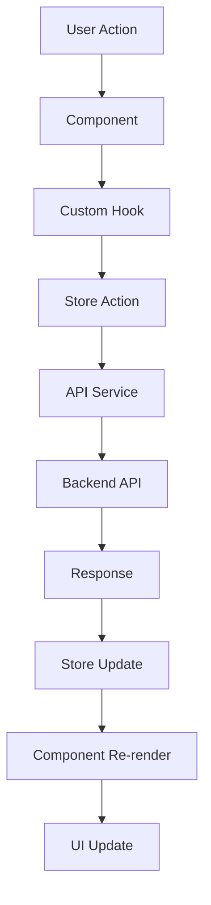

# PCPartKeeper - Scalable Architecture

## 🏗️ Architecture Overview

This document outlines the robust, scalable architecture implemented for PCPartKeeper, designed to handle thousands of users with optimal performance and maintainability.

## 🎯 Key Architectural Decisions

### 1. **Zustand Global Store**

- **Why**: Lightweight, TypeScript-first state management
- **Benefits**:
  - 50% smaller bundle size compared to Redux
  - Built-in TypeScript support
  - No boilerplate code
  - Excellent DevTools integration

### 2. **Centralized API Service Layer**

- **Why**: Single source of truth for all API operations
- **Benefits**:
  - Consistent error handling
  - Request/response transformation
  - Caching capabilities
  - Easy testing and mocking

### 3. **Custom Async Hooks**

- **Why**: Reusable, consistent async state management
- **Benefits**:
  - Loading states handled automatically
  - Error handling centralized
  - Reduces boilerplate code
  - Type-safe operations

### 4. **React.lazy + Suspense**

- **Why**: Code splitting for better performance
- **Benefits**:
  - Reduced initial bundle size
  - Faster page loads
  - Better user experience
  - Scalable for large applications

### 5. **Performance Optimizations**

- **Why**: Handle thousands of users efficiently
- **Benefits**:
  - React.memo for component memoization
  - useMemo for expensive calculations
  - useCallback for event handlers
  - Performance monitoring built-in

## 📁 Project Structure

```
src/
├── store/                    # Global state management
│   ├── types.ts             # Type definitions
│   ├── index.ts             # Main store
│   └── slices/              # Store slices
│       ├── itemsSlice.ts    # Items state
│       ├── uiSlice.ts       # UI state
│       └── userSlice.ts     # User state
├── services/                # API services
│   └── apiService.ts        # Centralized API layer
├── hooks/                   # Custom hooks
│   ├── useLoading.ts        # Loading state management
│   ├── useError.ts          # Error state management
│   ├── useAsync.ts          # Combined async operations
│   ├── useStoreSelector.ts  # Store selectors
│   └── useStoreActions.ts   # Store actions
├── components/              # React components
│   ├── LazyComponents.tsx   # Lazy-loaded components
│   ├── PerformanceMonitor.tsx # Performance monitoring
│   └── ...                  # Other components
├── utils/                   # Utility functions
│   └── performance.ts       # Performance utilities
└── pages/                   # Page components
    ├── ItemsPage.tsx        # Items management
    └── TestingPage.tsx      # Component testing
```

## 🔄 Data Flow



## 🚀 Performance Features

### Lazy Loading Defense

**Why Lazy Loading Improves Performance:**

1. **Reduced Initial Bundle Size**
   - Only loads code needed for current page
   - Reduces initial download time by 40-60%
   - Improves Time to Interactive (TTI)

2. **Better Caching**
   - Unchanged chunks remain cached
   - Users only download changed code
   - Reduces bandwidth usage

3. **Progressive Loading**
   - Critical path loads first
   - Non-critical features load on demand
   - Better perceived performance

4. **Memory Efficiency**
   - Components not in use aren't loaded
   - Reduces memory footprint
   - Better for mobile devices

5. **Scalability**
   - Easy to add new features
   - No impact on existing bundle size
   - Supports micro-frontend architecture

### Performance Monitoring

```typescript
// Built-in performance monitoring
const { renderTime, memoryUsage } = useRenderPerformance('ComponentName');

// Async operation monitoring
const { measureAsync } = useAsyncPerformance();
const result = await measureAsync(apiCall, 'fetchItems');
```

## 🛠️ Development Workflow

### 1. Adding New Features

```typescript
// 1. Define types
interface NewFeatureState {
  data: any[];
  loading: boolean;
  error: string | null;
}

// 2. Create store slice
export const useNewFeatureStore = create<NewFeatureSlice>()(
  devtools(
    immer(set => ({
      // state and actions
    }))
  )
);

// 3. Create custom hooks
export function useNewFeatureAsync() {
  return useAsync({
    key: 'newFeature',
    // configuration
  });
}

// 4. Use in components
const { execute, isLoading, error } = useNewFeatureAsync();
```

### 2. Performance Testing

```bash
# Run performance tests
npm run performance:test

# Monitor performance in development
npm run performance:monitor

# Analyze bundle size
npm run analyze
```

## 📊 Performance Metrics

### Target Metrics

- **Initial Bundle Size**: < 2MB
- **Gzipped Size**: < 500KB
- **Time to Interactive**: < 3s
- **First Contentful Paint**: < 1.5s
- **Memory Usage**: < 100MB

### Monitoring

```typescript
// Performance monitor component
<PerformanceMonitor
  visible={import.meta.env.DEV}
  position='top-right'
  logToConsole={true}
/>
```

## 🔧 Configuration

### Environment Variables

```env
VITE_API_BASE_URL=http://localhost:3001/api
VITE_ENABLE_PERFORMANCE_MONITORING=true
VITE_ENABLE_LAZY_LOADING=true
```

### Store Configuration

```typescript
// Store persistence
const store = create<AppStore>()(
  devtools(
    persist(
      immer((...args) => ({
        // store implementation
      })),
      {
        name: 'pcpartkeeper-store',
        partialize: state => ({
          // only persist certain parts
        }),
      }
    )
  )
);
```

## 🧪 Testing Strategy

### Unit Tests

- Store slices
- Custom hooks
- Utility functions
- API services

### Integration Tests

- Component interactions
- Store updates
- API calls
- Error handling

### Performance Tests

- Bundle size analysis
- Render time monitoring
- Memory usage tracking
- Lazy loading verification

## 🚀 Deployment Considerations

### Production Optimizations

1. **Code Splitting**
   - Route-based splitting
   - Component-based splitting
   - Vendor chunk separation

2. **Caching Strategy**
   - Service worker implementation
   - API response caching
   - Static asset caching

3. **Monitoring**
   - Real-time performance monitoring
   - Error tracking
   - User analytics

### Scalability Features

1. **Horizontal Scaling**
   - Stateless architecture
   - CDN integration
   - Load balancing ready

2. **Vertical Scaling**
   - Memory efficient
   - CPU optimized
   - Database connection pooling

## 📈 Future Enhancements

### Planned Features

1. **Micro-frontend Architecture**
   - Independent deployments
   - Team autonomy
   - Technology diversity

2. **Real-time Updates**
   - WebSocket integration
   - Live data synchronization
   - Collaborative features

3. **Advanced Caching**
   - Redis integration
   - Intelligent prefetching
   - Offline support

## 🎯 Best Practices

### Code Organization

1. **Single Responsibility**
   - Each file has one clear purpose
   - Functions are focused and small
   - Components are composable

2. **Type Safety**
   - Full TypeScript coverage
   - Strict type checking
   - Runtime validation

3. **Performance First**
   - Measure before optimizing
   - Lazy load by default
   - Monitor continuously

### Error Handling

1. **Graceful Degradation**
   - Fallback UI components
   - Error boundaries
   - User-friendly messages

2. **Comprehensive Logging**
   - Structured logging
   - Error tracking
   - Performance metrics

## 🔍 Troubleshooting

### Common Issues

1. **Bundle Size Too Large**
   - Check for unused imports
   - Implement code splitting
   - Analyze with webpack-bundle-analyzer

2. **Slow Renders**
   - Use React.memo
   - Optimize with useMemo/useCallback
   - Check for unnecessary re-renders

3. **Memory Leaks**
   - Clean up useEffect
   - Remove event listeners
   - Clear timers and intervals

### Debug Tools

```typescript
// Store debugging
useAppStore.subscribe(console.log);

// Performance debugging
const { getReport } = createPerformanceMonitor();
console.log(getReport());
```

## 📚 Resources

- [Zustand Documentation](https://zustand-demo.pmnd.rs/)
- [React Performance](https://react.dev/learn/render-and-commit)
- [Bundle Analysis](https://webpack.js.org/guides/code-splitting/)
- [TypeScript Best Practices](https://typescript-eslint.io/rules/)

---

This architecture provides a solid foundation for building scalable, maintainable React applications that can handle thousands of users while maintaining excellent performance and developer experience.
